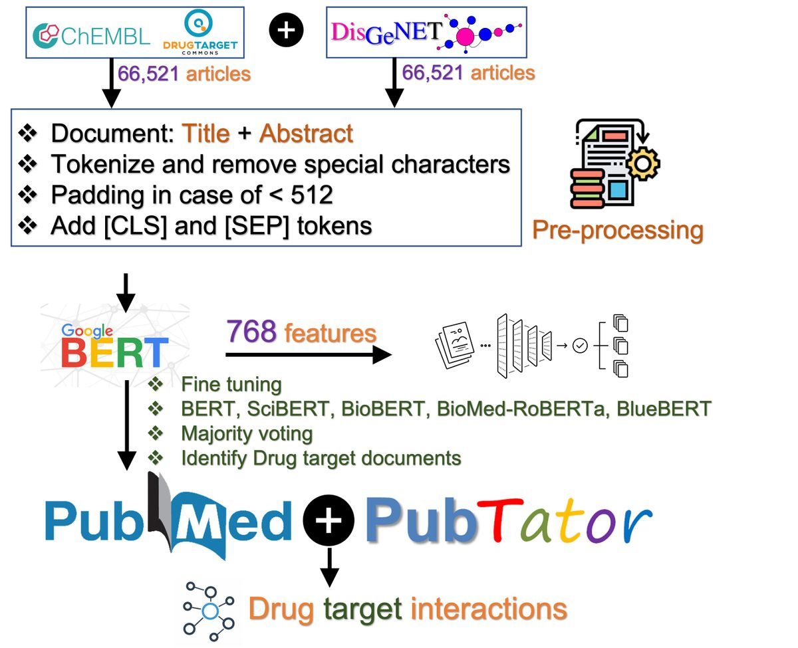

 

<h1 align="center"> Using BERT to identify drug-target interactions from whole PubMed
</h1>
<h3 align="center"> Code will be updated regularly </h3>  

 
  

<!-- TABLE OF CONTENTS -->
<h2 id="table-of-contents"> :book: Table of Contents</h2>

  
Table of Contents

  <ol>
    <li><a href="#about-the-project"> ➤ Introduction</a></li>
    <li><a href="#dataset"> ➤ Dataset</a></li>
    <li><a href="#prerequisites"> ➤ Prerequisites</a></li>
    <li><a href="#results-and-discussion"> ➤ Results and Discussion</a></li>
  </ol>

<!-- ABOUT THE PROJECT -->
<h2 id="about-the-project"> :pencil: About</h2>

 

Background: Drug-target interactions (DTIs) are critical for drug repurposing and elucidation of drug mechanisms, and are manually curated by large databases, such as ChEMBL, BindingDB, DrugBank and DrugTargetCommons. However, the number of curated articles likely constitutes only a fraction of all the articles that contain experimentally determined DTIs. Finding such articles and extracting the experimental information is a challenging task, and there is a pressing need for systematic approaches to assist the curation of DTIs. To this end, we applied Bidirectional Encoder Representations from Transformers (BERT) to identify such articles. Because DTI data intimately depends on the type of assays used to generate it, we also aimed to incorporate functions to predict the assay format.

<!-- PREREQUISITES -->
<h2 id="prerequisites"> :fork_and_knife: Prerequisites</h2>

  

<!--This project is written in Python programming language.  -->
The following open source packages are used in this project:  
* Numpy   
* Pandas  
* Matplotlib  
* Scikit-Learn  
* transformers  
* torch  

<!-- DATASET -->
<h2 id="dataset"> :floppy_disk: Dataset</h2>

 
Data used for the model's training contains 28,075 positive examples (articles containing compound-target bioactivity data) and 28,075 negative examples (other biological articles) is available at: 
<a href="https://dataset.drugtargetcommons.org/Training_DTIs_data/">https://dataset.drugtargetcommons.org/Training_DTIs_data/</a>. Compound-target articles are extracted from DrugTargetCommons and ChEMBL (27th release), whereas data for other biological documents is extracted from DisGeNET

<!-- EXPERIMENTS -->
<!--<h2 id="experiments"> :microscope: Experiments</h2>-->

<!-- RESULTS AND DISCUSSION -->
<h2 id="results-and-discussion"> :mag: Results and Discussion</h2>

Our novel method identified 0.6 million articles (along with drug and protein information) which are not previously included in public DTI databases. Using 10-fold cross-validation, we obtained ~ 99% accuracy for identifying articles containing quantitative drug-target profiles. The F1 micro for the prediction of assay format is 88%, which leaves room for improvement in future studies.

